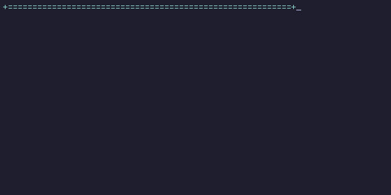

  

## 📊 GitHub Analytics

  <picture>
    <source
      media="(prefers-color-scheme: dark)"
      srcset="https://github-profile-summary-cards.vercel.app/api/cards/profile-details?username=sutz2001&theme=github_dark"
    />
    <source
      media="(prefers-color-scheme: light)"
      srcset="https://github-profile-summary-cards.vercel.app/api/cards/profile-details?username=sutz2001&theme=github"
    />
    
  </picture>

  <picture>
    <source
      media="(prefers-color-scheme: dark)"
      srcset="https://github-profile-summary-cards.vercel.app/api/cards/stats?username=sutz2001&theme=github_dark"
    />
    <source
      media="(prefers-color-scheme: light)"
      srcset="https://github-profile-summary-cards.vercel.app/api/cards/stats?username=sutz2001&theme=github"
    />
    
  </picture>
  &nbsp;&nbsp;&nbsp;&nbsp;
  <picture>
    <source
      media="(prefers-color-scheme: dark)"
      srcset="https://github-profile-summary-cards.vercel.app/api/cards/repos-per-language?username=sutz2001&theme=github_dark"
    />
    <source
      media="(prefers-color-scheme: light)"
      srcset="https://github-profile-summary-cards.vercel.app/api/cards/repos-per-language?username=sutz2001&theme=github"
    />
    
  </picture>

  <picture>
    <source
      media="(prefers-color-scheme: dark)"
      srcset="https://github-profile-summary-cards.vercel.app/api/cards/most-commit-language?username=sutz2001&theme=github_dark"
    />
    <source
      media="(prefers-color-scheme: light)"
      srcset="https://github-profile-summary-cards.vercel.app/api/cards/most-commit-language?username=sutz2001&theme=github"
    />
    
  </picture>
  &nbsp;&nbsp;&nbsp;&nbsp;
  <picture>
    <source
      media="(prefers-color-scheme: dark)"
      srcset="https://github-profile-summary-cards.vercel.app/api/cards/productive-time?username=sutz2001&theme=github_dark&utcOffset=2"
    />
    <source
      media="(prefers-color-scheme: light)"
      srcset="https://github-profile-summary-cards.vercel.app/api/cards/productive-time?username=sutz2001&theme=github&utcOffset=2"
    />
    
  </picture>

 

## 📈 Activity Graph

  <picture>
    <source
      media="(prefers-color-scheme: dark)"
      srcset="https://github-readme-activity-graph.vercel.app/graph?username=sutz2001&theme=react-dark&hide_border=true&area=true"
    />
    <source
      media="(prefers-color-scheme: light)"
      srcset="https://github-readme-activity-graph.vercel.app/graph?username=sutz2001&theme=minimal&hide_border=true&area=true"
    />
    
  </picture>

 

  <h3>🔥 Streak Stats</h3>
  <picture>
  <source
    media="(prefers-color-scheme: dark)"
    srcset="https://github-readme-streak-stats.herokuapp.com/?user=sutz2001&theme=dark&hide_border=true&background=1E1E1E&stroke=00F7FF&ring=00F7FF&fire=00F7FF&currStreakLabel=00F7FF&sideNums=00F7FF"
  />
  <source
    media="(prefers-color-scheme: light)"
    srcset="https://github-readme-streak-stats.herokuapp.com/?user=sutz2001&theme=default&hide_border=true"
  />
  
</picture>

---

  
<b>More stats</b>

   
  
  
  
  
  

---

From [sutz2001](https://github.com/sutz2001)

